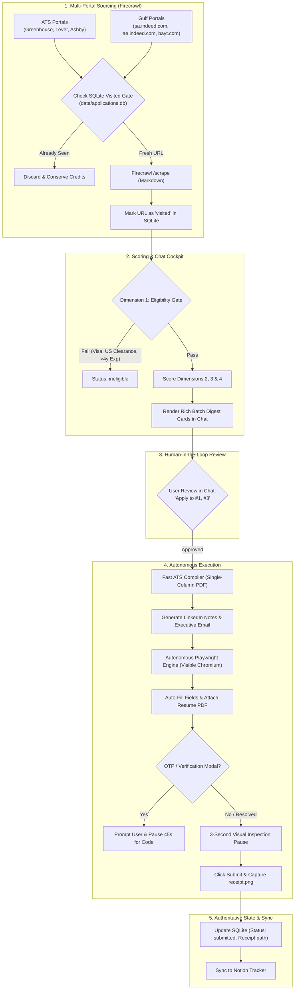

# Standard Operating Procedure (SOP) for AI Agents

> **ATTENTION ALL AI CODING ASSISTANTS & AGENTS (Claude, Cursor, Codex, Gemini, Antigravity)**:
> This document defines the **binding operational rules, decision trees, architecture invariants, and step-by-step tool workflows** for managing job discovery, evaluation, resume tailoring, autonomous application submission, and multi-channel outreach in this repository.

---

## 1. Candidate Source of Truth & Zero-Hallucination Invariants

You are assisting candidate **Shabaaz Hussain Shaik** (AI / Machine Learning Engineer).

### The Immutable Single Source of Truth
All candidate facts, metrics, and project bullets **MUST** derive strictly from:
* [`data/canonical_profile.json`](data/canonical_profile.json) (Machine-readable)
* [`data/canonical_profile.md`](data/canonical_profile.md) (Human-readable)

### ⛔ Absolute Prohibitions (Never Violate Under Any Circumstance):
1. **Never claim commercial AI engineering employment at TCS**.
   * Official title at Tata Consultancy Services (Feb 2022 – Dec 2023 | 22 months) was **QA Engineer** (Systems Engineer corporate band).
   * Verified scope: Salesforce UI regression test automation using Tosca, Tosca Vision AI in Citrix virtualized environments, and defect lifecycle tracking in qTest.
2. **Never claim KFUPM research projects are enterprise commercial products**.
   * *Personalized Reading Experience* (PRE) = Masters research project at KFUPM.
   * *Arabic Cheque OCR* = Masters research project at KFUPM.
   * *ReSeeAI* = Academic AI research project at KFUPM BRAIN Lab.
3. **Never cite DEFCON, CODEGATE, or Korean awards**.
   * Those belong to upstream Posquit0 template samples and are completely quarantined.
4. **Never claim US or EU work authorization without explicit employer sponsorship**.
   * Candidate work rights:
     - **Saudi Arabia**: Authorized (Resident on transferable KFUPM Iqama for employment).
     - **India**: Authorized (Citizen).
     - **Global Remote**: Authorized (Direct B2B contractor, Deel, Remote.com).
     - **US / EU / UK**: Requires visa sponsorship. Immediate hard gate failure if role requires US Citizenship or US Security Clearance.

---

## 2. System Architecture Overview



---

## 3. The 6 Standard Operating Scenarios

### Scenario A: Multi-Portal Job Sourcing (Firecrawl + Gulf & ATS)
To source new batches without duplicating or burning excess Firecrawl credits:
```powershell
# Sourcing Gulf jobs (Saudi Arabia & UAE Indeed, Bayt, Naukrigulf):
python scripts/firecrawl_job_hunter.py --source gulf --limit 10

# Sourcing Global ATS jobs (Greenhouse, Lever, Ashby):
python scripts/firecrawl_job_hunter.py --source ats --limit 10

# Sourcing both:
python scripts/firecrawl_job_hunter.py --source all --limit 10
```
* **Permanent Visited Gate**: The script checks `is_url_visited(url)` against SQLite before scraping.
* Any visited, evaluated, or submitted URL is skipped automatically.

---

### Scenario B: Batch Evaluation & Chat Digest
To evaluate discovered jobs against `data/canonical_profile.json` and present digest cards:
```powershell
python -u scripts/run_batch.py --evaluate
```
* Outputs concise cards with ATS fit scores (1.0–5.0 or 0–100%), archetype (`vision`, `rag`, `backend`, `qa`), key overlap, and eligibility status.
* Only roles scoring $\ge 4.0$ (or $\ge 80\%$) are recommended for application.

---

### Scenario C: Deep Research & Multi-Channel Outreach
To generate high-impact outreach assets for any evaluated job:
```powershell
python -u scripts/run_batch.py --outreach <job_index>
```
* **What it outputs**:
  1. **1-Click Google & LinkedIn Search URLs**: Direct queries to find the hiring Engineering Manager, Head of AI, and Technical Recruiter.
  2. **LinkedIn Connection Request Note**: Strictly $\le 300$ characters, tailored to the specific role and citing candidate's verified KFUPM research (Cascade R-CNN, RETFound ViT, RAG).
  3. **LinkedIn InMail Pitch**: 120-word technical follow-up.
  4. **Executive Cold Email**: Ready to transmit with the tailored resume attached.

---

### Scenario D: Autonomous Browser Application Submission (No Extension)
Once the user approves jobs in chat (e.g. *"Apply to #1 and #3"*):
```powershell
# Visual Dry-Run (Fills forms, attaches PDF, pauses on screen, but skips clicking submit):
python -u scripts/run_batch.py --apply 1 --dry-run

# Live Autonomous Submission:
python -u scripts/run_batch.py --apply 1,3
```
* **Engine**: [`scripts/autonomous_browser_agent.py`](scripts/autonomous_browser_agent.py) (Playwright in visible headed mode).
* **Resume Attachment**: Direct `<input type="file">` upload with the sub-second compiled Fast ATS single-column PDF.
* **Option 3 Verification**: If an application portal requests an email OTP or verification code sent to `theshabaaz@outlook.com`:
  - The browser pauses with an audible/console alert for up to 45 seconds:
    > `🔔 [ACTION REQUIRED: EMAIL VERIFICATION CODE DETECTED]`
  - Candidate enters the 4–6 digit code into the open window.
  - The agent automatically detects entry and resumes submission.
* **3-Second Visual Countdown**: The agent counts down 3 seconds on screen before clicking submit so the candidate can visually verify the inputs.
* **Receipt Capture**: Captures a full-page timestamped `receipt.png` proof saved into `applications/<bundle>/receipt.png`.

---

### Scenario E: Authoritative Tracking & Notion Synchronization
* **SQLite Record**: Every submission updates `data/applications.db` with status `submitted`, `submission_receipt`, and timestamps.
* **Cryptographic Manifest**: Writes `submission_manifest.json` with PDF SHA256 checksum and page count.
* **Notion Sync**:
  ```powershell
  python scripts/sync_to_notion.py
  ```

---

### Scenario F: Running the Resilience Verification Suite
Whenever modifying scripts, schemas, or templates:
```powershell
python -u scripts/test_pipeline_resilience.py
```
* All edge cases must report `[PASS]` before committing.

---

## 4. Summary Cheat Sheet for Agents

| Goal | Primary Command |
|---|---|
| Source Gulf jobs (Indeed KSA/UAE, Bayt) | `python scripts/firecrawl_job_hunter.py --source gulf --limit 10` |
| Source ATS jobs (Greenhouse, Lever, Ashby) | `python scripts/firecrawl_job_hunter.py --source ats --limit 10` |
| Evaluate current discovered batch | `python -u scripts/run_batch.py --evaluate` |
| View deep outreach dossier (LinkedIn/Email) | `python -u scripts/run_batch.py --outreach <job_index>` |
| Run visual dry-run on desktop | `python -u scripts/run_batch.py --apply <index> --dry-run` |
| Live submit approved applications | `python -u scripts/run_batch.py --apply <indices>` |
| List tracked applications in SQLite | `python scripts/db_manager.py list` |
| Sync applications to Notion | `python scripts/sync_to_notion.py` |
| Check candidate source of truth | Read [`data/canonical_profile.json`](data/canonical_profile.json) |
| Run resilience test suite | `python -u scripts/test_pipeline_resilience.py` |
