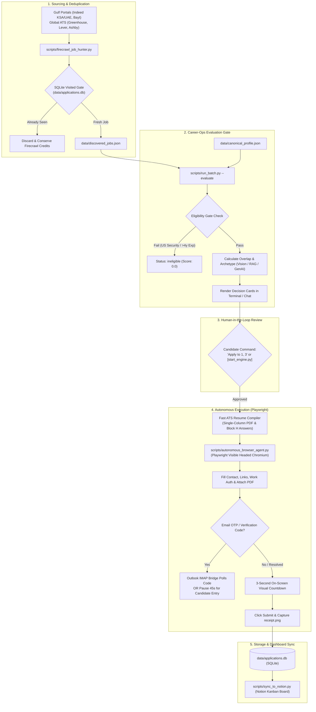

# Career-Ops Autonomous HITL Job Application Engine: Master Runbook

> **Autonomous Human-in-the-Loop (HITL) Automation Engine for AI / Machine Learning Job Applications**  
> Candidate: **Shabaaz Hussain Shaik** (AI / Machine Learning Engineer)  
> Target Markets: **Saudi Arabia (Resident, Transferable Iqama)**, **UAE**, **Global Remote**  
> Primary Stack: Python 3.12, Playwright Chromium (Headed Mode), Fast ATS Tailor, SQLite3, Notion API, Tectonic XeTeX

---

## 1. System Architecture & Component Overview

This system is an **autonomous Python automation pipeline** operating under a strict **Human-in-the-Loop (HITL)** governance model. It is **not** a browser extension. The entire process runs directly on your machine through Python scripts or the interactive terminal cockpit (`start_engine.py`).



---

## 2. Fast-Track: How to Start the Engine

### Option A: Interactive Cockpit (Recommended)
Double-click `start_engine.bat` (on Windows) or run:
```powershell
python start_engine.py
```
This opens the interactive terminal cockpit:
```text
================================================================================
   AUTONOMOUS HUMAN-IN-THE-LOOP JOB APPLICATION ENGINE
================================================================================
CHOOSE AN ENGINE ACTION:
  [1] 🔍  Source Fresh Jobs          (Firecrawl hunter: Gulf + Global ATS)
  [2] 📊  Evaluate Discovered Batch  (Score match & render chat digest cards)
  [3] 🚀  Autonomous Apply (Dry-Run) (Headed Playwright: fills form & pauses)
  [4] ⚡  Autonomous Apply (Live)    (Auto-fills, waits for OTP, submits & proof)
  [5] 📬  Generate Outreach Dossier  (1-Click LinkedIn notes & cold emails)
  [6] 🔄  Sync Applications to Notion(Pushes SQLite records to Notion board)
  [7] 📋  View Application Tracker   (View all tracked jobs in SQLite)
  [8] 🧪  Run Resilience Test Suite  (Execute all 9 automated tests)
  [9] 🏥  System Health Diagnostics  (Check all local engines & API tokens)
  [0] ❌  Exit Engine
--------------------------------------------------------------------------------
Enter choice [0-9]:
```

### Option B: Direct CLI Commands
| Goal | Command |
|---|---|
| **System Diagnostics** | `python start_engine.py --health` |
| **Evaluate Batch & Show Cards** | `python start_engine.py --evaluate` |
| **Visual Dry-Run (Headed Mode)** | `python start_engine.py --apply 1 --dry-run` |
| **Live Autonomous Submission** | `python start_engine.py --apply 1,3` |
| **Generate Outreach Dossier** | `python start_engine.py --outreach 1` |
| **Sync with Notion** | `python start_engine.py --sync` |
| **List SQLite Applications** | `python start_engine.py --list` |
| **Run All 9 Resilience Tests** | `python start_engine.py --test` |
| **Source Fresh Jobs (Gulf)** | `python start_engine.py --source gulf` |
| **Source Fresh Jobs (ATS)** | `python start_engine.py --source ats` |

---

## 3. Detailed Operational Phases

### Phase 1: Multi-Portal Job Sourcing
* **Script**: [`scripts/firecrawl_job_hunter.py`](scripts/firecrawl_job_hunter.py)
* **What it does**:
  1. Loads known URLs from SQLite (`data/applications.db`).
  2. Queries Firecrawl API for targeted roles across Saudi Arabia (Riyadh, Dhahran, Khobar, Jeddah), UAE (Dubai, Abu Dhabi), and Remote ATS portals (Greenhouse, Lever, Ashby, Indeed, Bayt).
  3. Pre-filters URLs against the SQLite database **before** scraping to eliminate duplicates and conserve credits.
  4. Automatically extracts recruiter contact emails from job descriptions.
  5. Saves fresh unvisited opportunities to `data/discovered_jobs.json`.

### Phase 2: Evaluation & Scoring Cockpit
* **Script**: [`scripts/run_batch.py --evaluate`](scripts/run_batch.py)
* **What it does**:
  1. Ingests discovered jobs from `data/discovered_jobs.json`.
  2. Enforces the **Eligibility Gate**: automatically flags roles as `ineligible` if they require US citizenship, US security clearance, or > 4 years mandatory enterprise experience.
  3. Extracts keywords and detects the technical archetype (`VISION`, `RAG`, `BACKEND`, `QA`).
  4. Computes the ATS match score against candidate skills from `data/canonical_profile.json`.
  5. Renders decision-ready markdown digest cards in the console/chat.

### Phase 3: Human-in-the-Loop (HITL) Decision
* You review the match score, archetype, and key overlap in the terminal or chat.
* You decide which jobs to proceed with:
  * Run a **Visual Dry-Run** first: `python start_engine.py --apply 1 --dry-run`
  * Or proceed to **Live Submission**: `python start_engine.py --apply 1,3`

### Phase 4: Sub-Second Tailoring & Autonomous Browser Submission
* **Tailoring Engine**: [`scripts/fast_ats_tailor.py`](scripts/fast_ats_tailor.py)
  * Generates an ATS-compliant, single-column resume PDF in ~3.0s.
  * Formulates tailored **Block H Screener Answers** (technical pitch, work authorization, years of experience, notice period, portfolio links) strictly derived from canonical truth.
* **Autonomous Browser Submitter**: [`scripts/autonomous_browser_agent.py`](scripts/autonomous_browser_agent.py)
  * Spawns a visible Playwright Chromium browser window on your desktop.
  * Navigates to the job application portal (Greenhouse, Lever, Ashby, or generic ATS).
  * Auto-fills candidate personal details, contact info, LinkedIn, GitHub, and portfolio URLs.
  * Injects tailored Block H answers into open text questions.
  * Locates the `<input type="file">` element and attaches the tailored resume PDF.
  * **Option 3 Verification**: If the portal requests an email OTP or verification code sent to `theshabaaz@outlook.com`:
    * The script activates [`scripts/outlook_bridge.py`](scripts/outlook_bridge.py) to poll the inbox via IMAP.
    * Concurrently displays an audible/visual alert and pauses for 45 seconds to allow manual code entry if preferred.
  * **3-Second Visual Inspection**: Displays a countdown overlay in the console so you can inspect the filled fields.
  * **Submission & Receipt**: In live mode, clicks Submit and captures a full-page screenshot saved as `applications/<bundle>/receipt.png`.

### Phase 5: Persistence & Notion Dashboard Sync
* **SQLite Store**: Updates `data/applications.db` with status `submitted`, timestamp, and screenshot receipt path.
* **Cryptographic Manifest**: Saves `submission_manifest.json` with PDF SHA256 checksum and page count.
* **Notion Sync**: [`scripts/sync_to_notion.py`](scripts/sync_to_notion.py) automatically pushes or updates the entry in your Notion Kanban database (`Career-Ops Job Applications`).

---

## 4. Candidate Evidence Boundaries (Zero-Hallucination Invariants)

All resume tailoring, screener answers, and automated submissions are strictly constrained by [`data/canonical_profile.json`](data/canonical_profile.json):

1. **Commercial Industry Employment**:
   * **Tata Consultancy Services (TCS)** (Feb 2022 – Dec 2023 | 22 months).
   * Official Title: **QA Engineer** (Systems Engineer).
   * Verified Scope: Salesforce UI regression test automation with Tosca, Tosca Vision AI in Citrix virtualized environments, and defect tracking in qTest.
   * *Invariant*: Never claim commercial AI engineering employment at TCS.
2. **Academic AI Research & Employment**:
   * **KFUPM BRAIN Lab & CS Department** (Oct 2024 – Present).
   * Master's Degree in Artificial Intelligence (GPA: 3.6/4.0).
   * Role: Graduate Assistant (teaching CS tutorials, consolidating inventory database).
   * Projects: *Personalized Reading Experience* (OCR with Cascade R-CNN, CRNN, Qwen3.5 VLM — 97.5% acc), *ReSeeAI* (RETFound ViT medical foundation models — 0.94 ROC-AUC).
3. **Work Authorization**:
   * **Saudi Arabia**: Fully authorized (Resident on transferable KFUPM Iqama for employment).
   * **India**: Authorized (Citizen).
   * **Global Remote**: Authorized (Direct contractor, Deel, B2B).
   * **US / EU / UK**: Requires employer visa sponsorship. Immediate hard gate failure if role mandates US Citizenship or US Security Clearance.

---

## 5. Troubleshooting & Maintenance

| Symptom | Cause | Solution |
|---|---|---|
| `Playwright Chromium launch failure` | Chromium browser binaries missing | Run `playwright install chromium` in your terminal. |
| `Outlook OTP connection error` | Microsoft app password missing or expired | Ensure `OUTLOOK_PASSWORD` in `.env` is a valid Microsoft App Password (generated at account.live.com/proofs/AppPassword). |
| `Notion rate limit (429)` | Exceeded 3 requests/sec | Built-in exponential backoff handles this automatically; no intervention required. |
| `Job page shows Cloudflare bot block` | Anti-bot challenge on portal | Open the URL directly in your regular browser or paste the job description text into the CLI. |
| `Tectonic compile warning` | Tectonic binary not on PATH | Fast ATS HTML-to-PDF compiler automatically runs as fallback; to use Tectonic XeTeX, add its directory to your system PATH. |

---

## 6. Verification Suite

Whenever modifying scripts, scoring formulas, or profile facts, always run:
```powershell
python start_engine.py --test
```
Ensure all 9 edge cases report `[PASS]` before applying to live roles.
