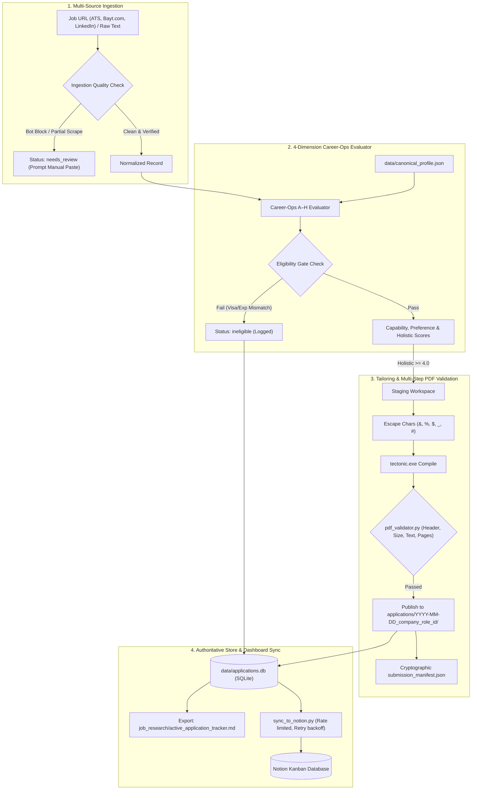

# Career-Ops & Job Hunter Automation Pipeline

An industrial-grade, verified automation engine for discovering, evaluating, tailoring, and tracking AI / Machine Learning job applications across Saudi Arabia, the UAE, and global remote markets.

---

## 1. System Architecture



---

## 2. Directory Structure

```text
career-ops-automation/
├── .agents/
│   └── skills/job-hunter-firecrawl/SKILL.md  # Agent skill instructions & prompts
├── scripts/
│   ├── compile_tailored_resume.py             # Collision-proof LaTeX builder & stager
│   ├── pdf_validator.py                       # Binary, structural & text stream validator
│   ├── db_manager.py                          # SQLite store manager & Markdown exporter
│   ├── sync_to_notion.py                      # Resilient Notion synchronization bridge
│   └── test_pipeline_resilience.py            # Automated 8-test edge case suite
├── data/
│   ├── canonical_profile.json                 # Immutable candidate single source of truth
│   ├── canonical_profile.md                   # Human-readable evidence boundaries
│   └── applications.db                        # Authoritative SQLite local store
├── job_research/
│   ├── active_application_tracker.md          # Auto-exported view of applications
│   ├── ats_profile.json                       # Form autofill reference
│   ├── ats_form_master_profile.md             # Standard ATS answers
│   └── notion_setup_guide.md                  # 2-minute Notion connection setup
├── my-resume/                                 # Awesome-CV LaTeX master template
├── applications/                              # Generated tailored application packages
├── .env                                       # Notion credentials (gitignored)
└── .env.example
```

---

## 3. Quick Start & Common Commands

### A. Run Automated Resilience Tests (All 8 Edge Cases)
```powershell
python scripts/test_pipeline_resilience.py
```

### B. List Applications from SQLite Store
```powershell
python scripts/db_manager.py list
```

### C. Compile a Tailored Resume Bundle
```powershell
python scripts/compile_tailored_resume.py --company "Aramco Digital" --role "AI Engineer" --req-id "REQ_101" --focus "vision"
```

### D. Update Application Status (Requires Confirmation for Submission)
```powershell
python scripts/db_manager.py set-status --id "2026-09-09_aramco-digital_ai-engineer_req_101" --status "submitted" --receipt "CONF-98765"
```

### E. Sync to Notion Dashboard
```powershell
# Dry run:
python scripts/sync_to_notion.py --dry-run

# Live sync:
python scripts/sync_to_notion.py
```

---

## 4. Integrity & Candidate Grounding
All claims are strictly bounded by `data/canonical_profile.json`. Never claim commercial AI engineering employment for academic or personal research.
