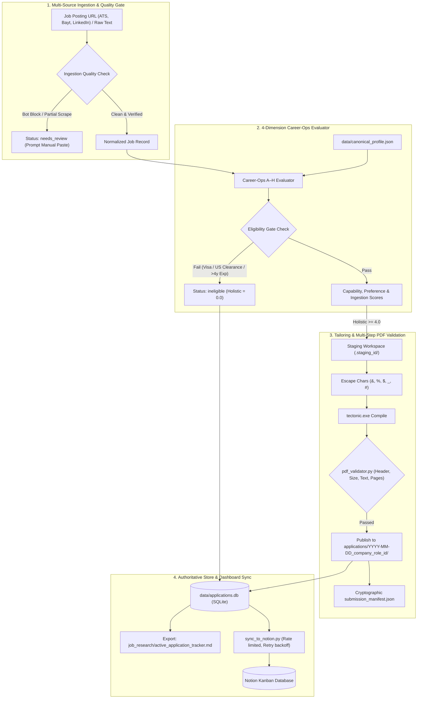

# Career-Ops & Job Hunter Automation Pipeline

An industrial-grade, verified automation engine for discovering, evaluating, tailoring, and tracking AI / Machine Learning job applications across Saudi Arabia, the UAE, and global remote markets.

> 🤖 **For AI Agents (Cursor, Claude Code, Gemini CLI, Antigravity, Codex)**:
> Please read [`AGENT_SOP.md`](AGENT_SOP.md) before executing tasks in this repository. It defines binding rules for candidate facts, prompt-injection defense, scoring gates, and tool commands.

---

## 1. System Architecture



---

## 2. Directory Structure

```text
career-ops-automation/
├── AGENT_SOP.md                               # Operational manual for AI coding agents
├── .agents/
│   └── skills/job-hunter-firecrawl/SKILL.md  # Agent skill instructions & evaluation prompts
├── scripts/
│   ├── compile_tailored_resume.py             # Collision-proof LaTeX builder & stager
│   ├── pdf_validator.py                       # Binary, structural & text stream validator
│   ├── db_manager.py                          # SQLite store manager & Markdown exporter
│   ├── sync_to_notion.py                      # Resilient Notion synchronization bridge
│   └── test_pipeline_resilience.py            # Automated 8-test edge case suite
├── data/
│   ├── canonical_profile.json                 # Immutable candidate single source of truth
│   ├── canonical_profile.md                   # Human-readable evidence boundaries
│   └── applications.db                        # Authoritative SQLite local store (11 jobs)
├── job_research/
│   ├── active_application_tracker.md          # Auto-exported view of applications
│   ├── ats_profile.json                       # Form autofill reference
│   ├── ats_form_master_profile.md             # Standard ATS answers
│   └── notion_setup_guide.md                  # 2-minute Notion connection setup
├── my-resume/                                 # Awesome-CV LaTeX master template for tailoring
├── applications/                              # Generated application bundles (gitignored)
├── .env                                       # Notion credentials (gitignored)
├── .env.example                               # Credential template
├── .gitignore                                 # Excludes build artifacts & credentials
└── README.md                                  # System overview & setup guide
```

---

## 3. Quick Start & Prerequisites

### Prerequisites
* **Python 3.10+** (with `pymupdf` installed: `pip install pymupdf`)
* **Tectonic XeTeX** (fast XeTeX engine installed or available on PATH)
* **Git & GitHub CLI (`gh`)**

### 1-Minute Setup
```powershell
# 1. Clone or navigate to the repository
cd career-ops-automation

# 2. Copy the environment configuration
cp .env.example .env
# Edit .env with your NOTION_API_KEY and NOTION_DATABASE_ID

# 3. Verify pipeline health across all 8 resilience tests
python -u scripts/test_pipeline_resilience.py
```

---

## 4. Key Operational Commands

### A. Run Automated Resilience Tests (All 8 Edge Cases)
Verifies deduplication, collision-proof folders, bot-block handling, ineligible job gates, LaTeX escaping, PDF validation, submission gates, and Notion offline safety:
```powershell
python -u scripts/test_pipeline_resilience.py
```

### B. List Applications from SQLite Store
```powershell
# List all tracked applications:
python scripts/db_manager.py list

# Filter by lifecycle status:
python scripts/db_manager.py list --status prepared
```

### C. Browser Extension & Local Command Hub (1-Click Copilot)
Start the local server daemon to enable 1-click ATS evaluation, tailored PDF generation, and React/Remix form autofill directly from your browser:
```powershell
# Launch the Local Command Hub:
python -u scripts/local_server.py
```
* **Chrome / Edge Extension**: Located in [`browser_extension/`](browser_extension/README.md).
* **3-Stage Workflow**: Check Fit & Score (10ms preview) → Candidate Decision Gate (`I Want to Apply`) → Sub-second ATS PDF compilation + 1-Click Form Autofill + Confirmed Submission Gate (`Mark as Applied`).
* **API Endpoints**: `http://127.0.0.1:8765/api/` (`health`, `check-job`, `evaluate`, `tailor`, `pdf`, `open-pdf`, `open-folder`, `mark-applied`).

### D. Instant Sub-Second ATS Resume Tailoring (CLI)
Extracts keywords from any job description, calculates an ATS match score, generates keyword diffs, compiles an ATS single-column PDF via native Windows Edge, and prepares Block H answers:
```powershell
# Fast ATS adaptation from raw text or job description:
python scripts/fast_ats_tailor.py `
  --company "Aramco Digital" `
  --role "Computer Vision Engineer" `
  --jd "Seeking experience in PyTorch, Cascade R-CNN, OCR, image processing, and Docker." `
  --benchmark

# With immediate 1-click Notion sync:
python scripts/fast_ats_tailor.py `
  --company "Wynd Labs" `
  --role "AI Platform Engineer" `
  --jd-file "job_research/sample_jd.txt" `
  --sync
```

### E. Compile Awesome-CV LaTeX Resume Bundle
Creates a collision-proof folder, substantively tailors summary and skills from canonical data, escapes special characters, compiles via Tectonic XeTeX, validates PDF, and creates `submission_manifest.json`:
```powershell
python scripts/compile_tailored_resume.py `
  --company "Aramco Digital" `
  --role "AI & Vision Engineer" `
  --req-id "REQ_9942" `
  --focus "vision" `
  --url "https://jobs.aramco.com/example"
```

### E. Update Application Status (Enforced Submission Gate)
You cannot transition an application to `submitted` without confirmed evidence:
```powershell
# Correct: with confirmation receipt
python scripts/db_manager.py set-status `
  --id "2026-09-09_aramco-digital_ai-vision-engineer_req_9942" `
  --status "submitted" `
  --receipt "CONF-APP-2026-8812"

# If network drops or confirmation is pending:
python scripts/db_manager.py set-status `
  --id "2026-09-09_aramco-digital_ai-vision-engineer_req_9942" `
  --status "submission_uncertain"
```

### E. Export Markdown Tracker View
Regenerates `job_research/active_application_tracker.md` directly from the SQLite store:
```powershell
python scripts/db_manager.py export
```

### F. Resilient Notion Sync
```powershell
# Validate local database mapping (safe dry-run):
python scripts/sync_to_notion.py --dry-run

# Live synchronization with 3 req/sec rate limiting & exponential backoff:
python scripts/sync_to_notion.py
```

---

## 5. Candidate Grounding & Anti-Hallucination Integrity

All evaluations and resume tailoring are strictly bounded by [`data/canonical_profile.json`](data/canonical_profile.json):
* **Commercial Industry Employment**: QA Engineer at Tata Consultancy Services (TCS) (Feb 2022 – Dec 2023 | 22 months) — Salesforce UI regression testing with Tosca, Tosca Vision AI, and qTest.
* **Academic Employment**: Graduate Assistant at KFUPM (Oct 2024 – Apr 2026) — CS tutorial teaching and inventory database consolidation.
* **Academic Research Projects**: KFUPM Masters (*Personalized Reading Experience*, *Arabic Cheque OCR*, *ReSeeAI*).
* **Work Authorization**: Saudi Arabia (Resident, Transferable KFUPM Iqama), India (Citizen), Global Remote (Contractor/B2B). US/EU requires visa sponsorship.

**Never** claim commercial AI engineering employment at TCS. **Never** cite quarantined template awards (DEFCON, CODEGATE, POSTECH).

---

## 6. Granular Lifecycle States

| State | Definition | Transition Requirement |
|---|---|---|
| `discovered` | Role found via search or link | URL or raw text captured |
| `ingestion_uncertain` | Scrape failed or partial | Incomplete scrape detected |
| `needs_review` | Scrape needs manual text paste | Missing requirements or bot block |
| `ineligible` | Failed legal/hard gate | Visa or mandatory exp mismatch |
| `evaluated` | Blocks A–G evaluated | Scored across 4 dimensions |
| `prepared` | Resume tailored & compiled | PDF passes all validation checks |
| `ready_for_review` | Ready for candidate inspection | Candidate verifies tailored answers |
| `approved` | Candidate gave green light to apply | Explicit approval |
| `submitted` | Application submitted | **Requires confirmation ID or receipt** |
| `submission_uncertain` | Submission attempted but unconfirmed | Network drop / timeout during submit |
| `closed` / `rejected` | Role filled or rejected | Outcome logged |

---

## 7. Troubleshooting & FAQ

* **Issue: `tectonic.exe` not found on PATH**
  * *Solution*: The script automatically looks for `tectonic.exe` in `C:\Users\lords\AppData\Local\Programs\Python\Python312\Scripts\tectonic.exe` and system PATH. You can also place `tectonic.exe` in the scripts directory.
* **Issue: Notion sync returns 429 Too Many Requests**
  * *Solution*: `sync_to_notion.py` has built-in retry backoff with delays up to 4s.
* **Issue: Scraping returns bot-block or empty markdown**
  * *Solution*: Paste raw job text into the prompt. The evaluator will label it `manual_paste` and proceed cleanly.
